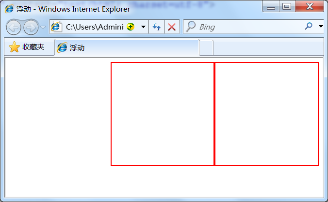
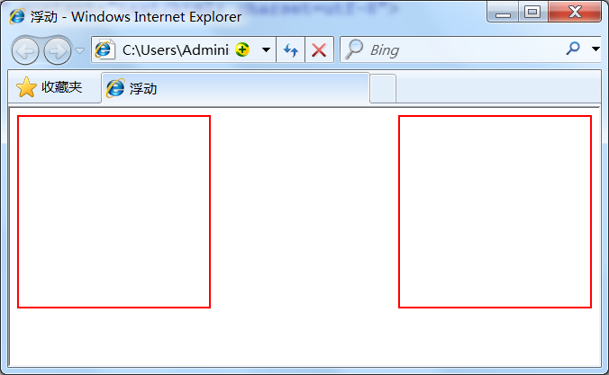
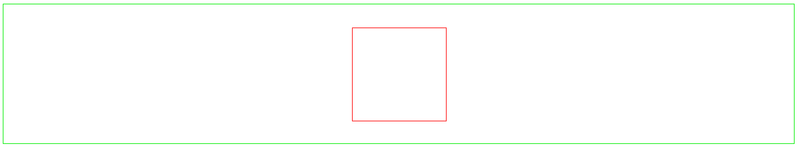

# 基础标签
## html5
`<p>段落文本</p>`  
`<header>`头部标签  
`<footer>`底部标签  
`<section>`定义区段  
`<aside>`定义侧边栏  
`<br/>`回<br/>车  
`&nbsp;` 空&nbsp;格  
`<hr/>` 水平线标签<hr/>
上述标签是为了语义化，便于搜索引擎收录  
`<ul><li></li></ul>` 无序列表
<ul>
  <li>列表1</li>
  <li>列表2</li>
</ul>

`<ol><li></li></ol>` 有序列表  
<ol>
   <li>列表1</li>
   <li>列表2</li>
</ol>

### 图片
``   

### 超链接
`<a  href="目标网址"  title="鼠标滑过显示的文本">链接显示的文本</a>`   
+ 超链接——打开网页的方式
    + `<a>`标签有的target属性，代表打开网页的方式。可选值为`_self`和`_blank`，默认值为`_self`，代表在当前页面打开链接，`_blank`代表在新窗口打开链接。  
    

### 表格
+ `<table>…</table>`：整个表格以`<table>`标记开始、`</table>`标记结束。
+ `<tr>…</tr>`：表格的一行，所以有几对tr 表格就有几行。
+ `<td>…</td>`：表格的一个单元格，一行中包含几对`<td>...</td>`，说明一行中就有几列。
+ `<th>…</th>`：表格的头部的一个单元格，表格表头。
+ 表格中列的个数，取决于一行中数据单元格的个数。
+ border属性可以为表格添加边框，属性值为数字。 
+ caption标签用来定义表格的标题。
+ table表格在没有添加border属性之前, 在浏览器中显示是没有表格线的。

<table border='1'>
        <caption>前端三剑客</caption>
        <tr><th>知识点</th><th>重要程度</th><th>难度</th><th>学习周期</th></tr>
        <tr><td>html</td><td>5</td><td>3</td><td>7</td></tr>
        <tr><td>css</td><td>5</td><td>4</td><td>10</td></tr> 
        <tr><td>js</td><td>5</td><td>5</td><td>20</td></tr>
</table>

#### thead、tbody、tfoot
+ `<thead>` 标签定义表格的表头。该标签用于组合 HTML 表格的表头内容。
+ `<tbody>…</tbody>`：如果不加`<thead>` `<tbody>` `<tfooter>` , table表格加载完后才显示。加上这些表格结构， tbody包含行的内容下载完优先显示，不必等待表格结束后在显示，同时如果表格很长，用tbody分段，可以一部分一部分地显示。（通俗理解table 可以按结构一块块的显示，不在等整个表格加载完后显示。）
+ `<tfoot>` 元素用于对 HTML 表格中的表注（页脚）内容进行分组。
+ thead、tfoot 以及 tbody元素使您有能力对表格中的行进行分组。当您创建某个表格时，您也许希望拥有一个标题行，一些带有数据的行，以及位于底部的一个总计行。这种划分使浏览器有能力支持独立于表格标题和页脚的表格正文滚动。当长的表格被打印时，表格的表头和页脚可被打印在包含表格数据的每张页面上。
    
### 表单
`<form   method="传送方式"   action="服务器文件">`  
1.`<form>` ：`<form>`标签是成对出现的，以`<form>`开始，以`</form>`结束。

2.action ：浏览者输入的数据被传送到的地方,比如一个PHP页面(save.php)。

3.method ： 数据传送的方式（get/post）。

#### 输入框 input

    <form>
     <input type="text/password" name="名称" value="文本" />
    </form>
    
1、type：
  + 当type="text"时，输入框为文本输入框;
  + 当type="password"时, 输入框为密码输入框。

2、name：为文本框命名，以备后台程序ASP 、PHP使用。

3、value：为文本输入框设置默认值。(一般起到提示作用)

##### 输入框占位符 placeholder
1、placeholder属性为输入框占位符,里面可以放提示的输入信息。

2、placeholder属性的值可以任意填写,当输入框输入内容时,占位符内容消失,输入框无内容时,占位符内容显示。

3、占位符内容不是输入框真正的内容。
##### 输入框 type属性  number
1、input的type属性设置为number,则表示该输入框的类型为数字。

2、数字框只能输入数字，输入其他字符无效。

3、数字框最右侧会有一个加减符号,可以调整输入数字的大小,不同浏览器表现不一致。
##### 输入框 type属性  url
1、input的type属性设置为url,则表示该输入框的类型为网址。

2、数字框的值需以http://或者https://开头,且后面必须有内容,否则表单提交的时候会报错误提示。
##### 输入框 type属性  email
1、Input的type属性设置为email,则表示该输入框的类型为邮箱。

2、数字框的值必须包含@。

3、数字框的值@之后必须有内容,否则会报错误提示。

##### 输入框 type属性  radio/checkbox
1、type:
+ 当 type="radio" 时，控件为单选框
+ 当 type="checkbox" 时，控件为复选框

2、value：提交数据到服务器的值（后台程序PHP使用）

3、name：为控件命名，以备后台程序 ASP、PHP 使用

4、checked：当设置 checked="checked" 时，该选项被默认选中

##### 输入框 type属性  submit
type：只有当type值设置为submit时，按钮才有提交作用

value：按钮上显示的文字

##### 输入框 type属性  reset
type：只有当type值设置为reset时，按钮才有重置作用

value：按钮上显示的文字


### 文本框
1、`<textarea>`标签是成对出现的，以`<textarea>`开始，以`</textarea>`结束。

2、cols ：多行输入域的列数。

3、rows ：多行输入域的行数。

4、在`<textarea>` `</textarea>`标签之间可以输入默认值。  
`<textarea  rows="12" cols="12">文本</textarea>`
### label
`<label for="控件id名称">`

标签的 for 属性中的值应当与相关控件的 id 属性值一定要相同。

### 下拉框 select
1、select和option标签都是双标签，它总是成对出现的，需要首标签和尾标签。

2、select标签里面只能放option标签，表示下拉列表的选项。

3、option标签放选项内容，不放置其他标签。

4、value：`<option value="提交值">选项</option>`

5、selected="selected"：设置selected="selected"属性，则该选项就被默认选中。

## css

```
p{
   font-size:12px;
   color:red;
   font-weight:bold;
}
```


### 内联式
`<p style="color:red">这里文字是红色。</p>`

注意要写在元素的开始标签里，下面这种写法是 __错误__ 的：

_`<p>这里文字是红色。</p style="color:red">`_
### 嵌入式
嵌入式css样式，就是可以把css样式代码写在`<style type="text/css"></style>`标签之间。如下面代码实现把三个`<span>`标签中的文字设置为红色：
```
<style type="text/css">
span{
    color:red;
}
</style>
```
### 外部式
`<link href="base.css" rel="stylesheet" type="text/css" />`

1、css样式文件名称以有意义的英文字母命名，如 main.css。

2、rel="stylesheet" type="text/css" 是固定写法不可修改。

3、<link>标签位置一般写在<head>标签之内。

### 优先级
`优先级：内联式 > 嵌入式 > 外部式`
但是嵌入式>外部式有一个前提：嵌入式css样式的位置一定在外部式的后面。如右代码编辑器就是这样，`<link href="style.css" ...>`代码在`<style type="text/css">...</style>`代码的前面（实际开发中也是这么写的）。感兴趣的小伙伴可以试一下，把它们调换顺序，再看他们的优先级是否变化。

其实总结来说，就是--就近原则（离被设置元素越近优先级别越高）。

### 选择器
#### 标签选择器
其实就是html代码中的标签。如右侧代码编辑器中的`<html>`、`<body>`、`<h1>`、`<p>`、``。例如下面代码：
`p{font-size:12px;line-height:1.6em;}`

#### 类选择器
1、英文圆点开头

2、其中类选器名称可以任意起名（但不要起中文噢）  

使用方法：
+ 使用合适的标签把要修饰的内容标记起来，如下：`<span>胆小如鼠</span>`
+ 使用class="类选择器名称"为标签设置一个类，如下：`<span class="stress">胆小如鼠</span>`
+ 设置类选器css样式，如下：`.stress{color:red;}/*类前面要加入一个英文圆点*/`

#### ID选择器

1、使用ID选择器，必须给标签添加上id属性，为标签设置id="ID名称"，而不是class="类名称"。

2、ID选择符的前面是井号（#）号，而不是英文圆点（.）。

3、id属性的值既为当前标签的id，尽量见名思意，语义化。

#### 类和ID选择器的区别
相同点：可以应用于任何元素
不同点：

1、ID选择器只能在文档中使用一次。与类选择器不同，在一个HTML文档中，ID选择器只能使用一次，而且仅一次。而类选择器可以使用多次。

下面代码是正确的：
```
 <p>三年级时，我还是一个<span class="stress">胆小如鼠</span>的小女孩，上课从来不敢回答老师提出的问题，生怕回答错了老师会批评我。就一直没有这个<span class="stress">勇气</span>来回答老师提出的问题。</p>
而下面代码是错误的：

 <p>三年级时，我还是一个<span id="stress">胆小如鼠</span>的小女孩，上课从来不敢回答老师提出的问题，生怕回答错了老师会批评我。就一直没有这个<span id="stress">勇气</span>来回答老师提出的问题。</p>
 ```
2、可以使用类选择器词列表方法为一个元素同时设置多个样式。我们可以为一个元素同时设多个样式，但只可以用类选择器的方法实现，ID选择器是不可以的（不能使用 ID 词列表）。

下面的代码是正确的(完整代码见右侧代码编辑器)
```
.stress{
    color:red;
}
.bigsize{
    font-size:25px;
}
<p>到了<span class="stress bigsize">三年级</span>下学期时，我们班上了一节公开课...</p>
```
上面代码的作用是为“三年级”三个文字设置文本颜色为红色并且字号为25px。

下面的代码是不正确的(完整代码见右侧代码编辑器)
```
#stressid{
    color:red;
}
#bigsizeid{
    font-size:25px;
}
<p>到了<span id="stressid bigsizeid">三年级</span>下学期时，我们班上了一节公开课...</p>
```
上面代码不可以实现为“三年级”三个文字设置文本颜色为红色并且字号为25px的作用。

#### 子选择器
`.food>li{border:1px solid red;}`  
这行代码会使class名为food下的子元素li（水果、蔬菜）加入红色实线边框。

#### 后代选择器

包含选择器，即加入空格,用于选择指定标签元素下的后辈元素。如右侧代码编辑器中的代码：

`.first  span{color:red;}`

请注意这个选择器与子选择器的区别，子选择器（child selector）仅是指它的直接后代，或者你可以理解为作用于子元素的第一代后代。而后代选择器是作用于所有子后代元素。后代选择器通过空格来进行选择，而子选择器是通过“>”进行选择。

总结：>作用于元素的**第一代**后代，**空格**作用于元素的**所有**后代。

#### 通用选择器
通用选择器是功能最强大的选择器，它使用一个（*）号指定，它的作用是匹配html中所有标签元素，如下使用下面代码使用html中任意标签元素字体颜色全部设置为红色：

`* {color:red;}`

#### 伪类选择器
更有趣的是伪类选择符，为什么叫做伪类选择符，它允许给html不存在的标签（标签的某种状态）设置样式，比如说我们给html中一个标签元素的鼠标滑过的状态来设置字体颜色：

`a:hover{color:red;}`
上面一行代码就是为 a 标签鼠标滑过的状态设置字体颜色变红。这样就会使第一段文字内容中的“胆小如鼠”文字加入鼠标滑过字体颜色变为红色特效。

关于伪选择符：
关于伪类选择符，到目前为止，可以兼容所有浏览器的“伪类选择符”就是 a 标签上使用 `:hover` 了（其实伪类选择符还有很多，尤其是 css3 中，但是因为不能兼容所有浏览器，本教程只是讲了这一种最常用的）。其实 `:hover` 可以放在任意的标签上，比如说`p:hover`，但是它们的兼容性也是很不好的，所以现在比较常用的还是 `a:hover` 的组合。

#### 分组选择器
当你想为html中多个标签元素设置同一个样式时，可以使用分组选择符（,），如下代码为右侧代码编辑器中的h1、span标签同时设置字体颜色为红色：  
`h1,span{color:red;}`  
它相当于下面两行代码：
```
h1{color:red;}
span{color:red;}
```
#### 选择器的优先级

1、如果一个元素使用了多个选择器,则会按照选择器的优先级来给定样式。

2、选择器的优先级依次是: 内联样式 > id选择器 > 类选择器 > 标签选择器 > 通配符选择器  

### 继承
CSS的**某些样式**是具有继承性的，那么什么是继承呢？继承是一种规则，它允许样式不仅应用于某个特定html标签元素，而且应用于其后代。比如下面代码：如某种颜色应用于p标签，这个颜色设置不仅应用p标签，还应用于p标签中的所有子元素文本，这里子元素为span标签。  


###  权值计算

```
p{color:red;}
.first{color:green;}
<p class="first">三年级时，我还是一个<span>胆小如鼠</span>的小女孩。</p>
```

p和.first都匹配到了p这个标签上，那么会显示哪种颜色呢？green是正确的颜色，那么为什么呢？是因为浏览器是根据权值来判断使用哪种css样式的，权值高的就使用哪种css样式。

下面是权值的规则：

标签的权值为1，类选择符的权值为10，ID选择符的权值最高为100。例如下面的代码：
```
p{color:red;} /*权值为1*/
p span{color:green;} /*权值为1+1=2*/
.warning{color:white;} /*权值为10*/
p span.warning{color:purple;} /*权值为1+1+10=12*/
#footer .note p{color:yellow;} /*权值为100+10+1=111*/
```  

**注意：** 还有一个权值比较特殊--继承也有权值但很低，有的文献提出它只有0.1，所以可以理解为继承的权值最低。

#### 最高权值 `!important`
如下代码：
```
p{color:red!important;}
p{color:green;}
<p class="first">三年级时，我还是一个<span>胆小如鼠</span>的小女孩。</p>
```
这时 p 段落中的文本会显示的red红色。

**注意：**`!important`要写在分号的前面

这里注意当网页制作者不设置css样式时，浏览器会按照自己的一套样式来显示网页。并且用户也可以在浏览器中设置自己习惯的样式，比如有的用户习惯把字号设置为大一些，使其查看网页的文本更加清楚。这时注意样式优先级为：**浏览器默认的样式 < 网页制作者样式 < 用户自己设置的样式**，但记住!important优先级样式是个例外，权值高于用户自己设置的样式。

### 字体

`body{font-family:"宋体";}`

#### 字号
`body{font-size:12px;}`
#### 粗细
`p span{font-weight:bold;}`
#### 样式
1、font-style可以设置字体样式，并且有种3设置方式。

2、正常字体为normal,也是font-style的默认值。

3、italic为设置字体为斜体，用于字体本身就有倾斜的样式。

4、oblique为设置倾斜的字体，强制将字体倾斜。
#### 颜色
1、color属性可以设置字体颜色。

2、color的值有3种设置方式：

+ 英文命令颜色  
`p{color:red;}`
+ RGB颜色  
这个与 photoshop 中的 RGB 颜色是一致的，由 R(red)、G(green)、B(blue) 三种颜色的比例来配色。  
`p{color:rgb(133,45,200);}`  
每一项的值可以是 0~255 之间的整数，也可以是 0%~100% 的百分数。如：
`p{color:rgb(20%,33%,25%);}`
+ 十六进制颜色  
这种颜色设置方法是现在比较普遍使用的方法，其原理其实也是 RGB 设置，但是其每一项的值由 0-255 变成了十六进制 00-ff。  
`p{color:#00ffff;}`

#### font简写
网页中的字体css样式代码也有他自己的缩写方式，下面是给网页设置字体的代码：
```
body{
    font-style:italic;
    font-weight:bold; 
    font-size:12px; 
    line-height:1.5em; 
    font-family:"宋体",sans-serif;
}
```
这么多行的代码其实可以缩写为一句：
```
body{
    font:italic  bold  12px/1.5em  "宋体",sans-serif;
}
```
**注意：**  
1、使用这一简写方式你至少要指定 `font-size` 和 `font-family` 属性，其他的属性(如 `font-weight` `font-style` `font-variant` `line-height`)如未指定将自动使用默认值。

2、在缩写时 `font-size` 与 `line-height` 中间要加入`/`斜扛。

一般情况下因为对于中文网站，英文还是比较少的，所以下面缩写代码比较常用：
```
body{
    font:12px/1.5em  "宋体",sans-serif;
}
```
只是有字号、行间距、中文字体、英文字体设置。

### 文本装饰
`text-decoration`可以设置添加到文本的修饰。

1、text-decoration默认值为none, 定义标准的文本。

2、text-decoration的值为underline为下划线。

3、text-decoration的值为overline为文本上的一条线。

4、text-decoration的值为line-through为删除线。

#### 首行缩进
`p{text-indent:2em;}`  
**注意：** 2em的意思就是文字的2倍大小
#### 行间距
`p{line-height:1.5em;}`
#### 字间距
+ 中文字间隔、字母间隔设置：`h1{letter-spacing:50px;}`
+ 单词间距设置：`h1{word-spacing:50px;}`
#### 对齐方式
`text-align:center;`
+ left 左
+ center 中
+ right 右

#### 长度

长度单位总结一下，目前比较常用到px（像素）、em、% 百分比，要注意其实这三种单位都是相对单位。

1、像素

像素为什么是相对单位呢？因为像素指的是显示器上的小点（CSS规范中假设“90像素=1英寸”）。实际情况是浏览器会使用显示器的实际像素值有关，在目前大多数的设计者都倾向于使用像素（px）作为单位。

2、em

就是本元素给定字体的 font-size 值，如果元素的 font-size 为 14px ，那么 1em = 14px；如果 font-size 为 18px，那么 1em = 18px。如下代码：  
`p{font-size:12px;text-indent:2em;}`  
上面代码就是可以实现段落首行缩进 24px（也就是两个字体大小的距离）。

下面注意一个特殊情况：

但当给 font-size 设置单位为 em 时，此时计算的标准以 p 的父元素的 font-size 为基础。如下代码：

html:  
`<p>以这个<span>例子</span>为例。</p>`  
css:  
`p{font-size:14px}`
`span{font-size:0.8em;}`  

结果 span 中的字体“例子”字体大小就为 11.2px（14 * 0.8 = 11.2px）。

3、百分比  
`p{font-size:12px;line-height:130%}`  
设置行高（行间距）为字体的130%（12 * 1.3 = 15.6px）。


### 元素 display
+ 常用的块状元素有：
```
<div>、<p>、<h1>...<h6>、<ol>、<ul>、<dl>、<table>、<address>、<blockquote> 、<form>
```
+ 常用的内联元素有：
```
<a>、<span>、<br>、<i>、<em>、<strong>、<label>、<q>、<var>、<cite>、<code>
```
+ 常用的内联块状元素有：
```
、<input>
```
#### 块状元素
在html中`<div>、 <p>、<h1>、<form>、<ul> 和 <li>`就是块级元素。设置display:block就是将元素显示为块级元素。如下代码就是将内联元素a转换为块状元素，从而使a元素具有块状元素特点。
`a{display:block;}`  
块级元素特点：

1、每个块级元素都从新的一行开始，并且其后的元素也另起一行。（真霸道，一个块级元素独占一行）

2、元素的高度、宽度、行高以及顶和底边距都可设置。

3、元素宽度在不设置的情况下，是它本身父容器的100%（和父元素的宽度一致），除非设定一个宽度。
#### 内联元素
在html中，`<span>、<a>、<label>、 <strong> 和<em>`就是典型的内联元素（行内元素）（inline）元素。当然块状元素也可以通过代码display:inline将元素设置为内联元素。如下代码就是将块状元素div转换为内联元素，从而使 div 元素具有内联元素特点。
```
 div{
     display:inline;
 }

......

<div>我要变成内联元素</div>
```
内联元素特点：

1、和其他元素都在一行上；

2、元素的**高度**、**宽度**及顶部和底部边距**不可**设置；  消除内联元素间距：
+ 设置父元素font-size: 0;
+ 设置浮动属性float(设置后会靠特定的方向)
+ 设置word-spacing属性值为负数   
  
3、元素的宽度就是它包含的文字或图片的宽度，不可改变。

#### 内联块状元素
内联块状元素（inline-block）就是同时具备内联元素、块状元素的特点，代码`display:inline-block`就是将元素设置为内联块状元素。(css2.1新增)，`、<input>`标签就是这种内联块状标签。

inline-block 元素特点：

1、和其他元素都在一行上；

2、元素的高度、宽度、行高以及顶和底边距都可设置。

#### 隐藏
`p {display:none;}`  
none设置此元素不会被显示，当想要元素隐藏的时候可以使用此值。  

#### 盒子模型
盒模型宽度和高度和我们平常所说的物体的宽度和高度理解是不一样的，css内定义的宽（width）和高（height），指的是填充以里的内容范围。

因此一个元素实际宽度（盒子的宽度）=左边界+左边框+左填充+内容宽度+右填充+右边框+右边界。
 
元素的高度也是同理。

比如：

css代码：
```
div{
    width:200px;
    padding:20px;
    border:1px solid red;
    margin:10px;    
}
```
html代码：
```
<body>
   <div>文本内容</div>
</body>
```
元素的实际长度为：10px+1px+20px+200px+20px+1px+10px=262px。在chrome浏览器下可查看元素盒模型，如下图：

 

#### 背景色
网页中的标签不论是行内元素还是块状元素都可以给它设置一个背景色。

为标签设置背景颜色可以使background-color:颜色值来实现。

例子如下：
```
div{background-color:red;}//为块状元素设置
a{background-color:green;}//为行内元素设置
```

#### 边框

盒子模型的边框就是围绕着内容及补白的线，这条线你可以设置它的粗细、样式和颜色(边框三个属性)。

如下面代码为 div 来设置边框粗细为 2px、样式为实心的、颜色为红色的边框：
```
div{
    border:2px  solid  red;
}
```
上面是 border 代码的缩写形式，可以分开写：
```
div{
    border-width:2px;
    border-style:solid;
    border-color:red;
}
```
注意：

1、border-style（边框样式）常见样式有：

dashed（虚线）| dotted（点线）| solid（实线）。


2、border-color（边框颜色）中的颜色可设置为十六进制颜色，如:

border-color:#888;//前面的井号不要忘掉。

3、border-width（边框宽度）中的宽度也可以设置为：

thin | medium | thick（但不是很常用），最常还是用像素（px）。

4、如果有想为 p 标签单独设置下边框，而其它三边都不设置边框样式怎么办呢？css 样式中允许只为一个方向的边框设置样式：  
`div{border-bottom:1px solid red;}`  
同样可以使用下面代码实现其它三边(上、右、左)边框的设置：

border-top:1px solid red;  
border-right:1px solid red;   
border-left:1px solid red;  

#### 圆角
元素边框的圆角效果可以使用border-radius属性来设置。圆角可分为左上、右上、右下、左下。如下代码：  
`div{border-radius: 20px 10px 15px 30px;}`  
也可以分开写：
```
div{
    border-top-left-radius: 20px;
   border-top-right-radius: 10px;
   border-bottom-right-radius: 15px;
   border-bottom-left-radius: 30px;
}
```
如果四个圆角都为10px;可以这么写：  
`div{ border-radius:10px;}`  
如果左上角和右下角圆角效果一样为10px，右上角和左下角圆角一样为20px，可以这么写：  
`div{ border-radius:10px 20px;}`  
需要特别注意的：一个正方形，当设置圆角效果值为元素宽度一半时，显示效果为圆形。例如：
```
 div {
        width: 200px;
        height: 200px;
        border: 5px solid red;
        border-radius: 100px;
    }
```
也可以写为百分比50%
```
 div {
        width: 200px;
        height: 200px;
        border: 5px solid red;
        border-radius: 50%;
    }
```

#### 填充
元素内容与边框之间是可以设置距离的，称之为“内边距（填充）”。填充也可分为上、右、下、左(顺时针)。如下代码：  
`div{padding:20px 10px 15px 30px;}`  
顺序一定不要搞混。可以分开写上面代码：
```
div{
   padding-top:20px;
   padding-right:10px;
   padding-bottom:15px;
   padding-left:30px;
}
```
如果上、右、下、左的填充都为10px;可以这么写  
`div{padding:10px;}`  
如果上下填充一样为10px，左右一样为20px，可以这么写：  
`div{padding:10px 20px;}`

#### 边界
元素与其它元素之间的距离可以使用边界（margin）来设置。边界也是可分为上、右、下、左。如下代码：  
`div{margin:20px 10px 15px 30px;}`  
也可以分开写：
```
div{
   margin-top:20px;
   margin-right:10px;
   margin-bottom:15px;
   margin-left:30px;
}
```
如果上右下左的边界都为10px;可以这么写：  
`div{ margin:10px;}`  
如果上下边界一样为10px，左右一样为20px，可以这么写：  
`div{ margin:10px 20px;}`  
总结一下：padding和margin的区别，padding在边框里，margin在边框外。

### 布局 
CSS3包含3种基本的布局模型，用英文概括为：Flow、Layer 和 Float。
在网页中，元素有三种布局模型：
1、流动模型（Flow）
2、浮动模型 (Float)
3、层模型（Layer）

#### 流动模型（Flow）
流动布局模型具有2个比较典型的特征：  
1、块状元素都会在所处的包含元素内自上而下按顺序垂直延伸分布，因为在默认状态下，块状元素的宽度都为100%。实际上，块状元素都会以行的形式占据位置。  
2、在流动模型下，内联元素都会在所处的包含元素内从左到右水平分布显示。（内联元素可不像块状元素这么霸道独占一行）

#### 浮动模型 (Float)
块状元素都是独占一行，如果现在我们想让两个块状元素并排显示，设置元素浮动就可以实现。

任何元素在默认情况下是不能浮动的，但可以用 CSS 定义为浮动，如 div、p、table、img 等元素都可以被定义为浮动。如下代码可以实现两个 div 元素一行显示。
```
div{
    width:200px;
    height:200px;
    border:2px red solid;
    float:left;
}
<div id="div1"></div>
<div id="div2"></div>
```
 
当然你也可以同时设置两个元素右浮动也可以实现一行显示。
```
div{
    width:200px;
    height:200px;
    border:2px red solid;
    float:right;
}
```
 
又有小伙伴问了，设置两个元素一左一右可以实现一行显示吗？当然可以：
```
div{
    width:200px;
    height:200px;
    border:2px red solid;
}
#div1{float:left;}
#div2{float:right;}
```
 

#### 层模型（Layer）
层布局模型就像是图像软件PhotoShop中非常流行的图层编辑功能一样，每个图层能够精确定位操作，但在网页设计领域，由于网页大小的活动性，层布局没能受到热捧。但是在网页上局部使用层布局还是有其方便之处的。
CSS定义了一组定位（positioning）属性来支持层布局模型。

层模型有三种形式：

1、绝对定位(position: absolute)

2、相对定位(position: relative)

3、固定定位(position: fixed)

##### 绝对定位(position: absolute)
如果想为元素设置层模型中的绝对定位，需要设置position:absolute(表示绝对定位)，这条语句的作用将元素从文档流中拖出来，然后使用left、right、top、bottom属性相对于其最接近的一个具有定位属性的父包含块进行绝对定位。如果不存在这样的包含块，则相对于body元素，即相对于浏览器窗口。

如下面代码可以实现div元素相对于浏览器窗口向右移动100px，向下移动50px。
```
div{
    width:200px;
    height:200px;
    border:2px red solid;
    position:absolute;
    left:100px;
    top:50px;
}

<div id="div1"></div>
```
 

##### 相对定位(position: relative)
如果想为元素设置层模型中的相对定位，需要设置position:relative（表示相对定位），它通过left、right、top、bottom属性确定元素在正常文档流中的偏移位置。相对定位完成的过程是首先按static(float)方式生成一个元素(并且元素像层一样浮动了起来)，然后相对于以前的位置移动，移动的方向和幅度由left、right、top、bottom属性确定，偏移前的位置保留不动。

如下代码实现相对于以前位置向下移动50px，向右移动100px;
```
#div1{
    width:200px;
    height:200px;
    border:2px red solid;
    position:relative;
    left:100px;
    top:50px;
}

<div id="div1"></div>
```
效果图：
 


什么叫做“偏移前的位置保留不动”呢？

大家可以做一个实验，在右侧代码编辑器的19行div标签的后面加入一个span标签，在标并在span标签中写入一些文字。如下代码：
```
<body>
    <div id="div1"></div><span>偏移前的位置还保留不动，覆盖不了前面的div没有偏移前的位置</span>
</body>
```
效果图：
 


从效果图中可以明显的看出，虽然div元素相对于以前的位置产生了偏移，但是div元素以前的位置还是保留着，所以后面的span元素是显示在了div元素以前位置的后面。

##### 相对其他元素定位
 使用position:absolute可以实现被设置元素相对于浏览器（body）设置定位。  
 使用position:relative可以实现相对于其它元素进行定位，但是必须遵守下面规范：

1、参照定位的元素必须是相对定位元素的前辈元素：
```
<div id="box1"><!--参照定位的元素-->
    <div id="box2">相对参照元素进行定位</div><!--相对定位元素-->
</div>
```
从上面代码可以看出box1是box2的父元素（父元素当然也是前辈元素了）。

2、参照定位的元素必须加入position:relative;
```
#box1{
    width:200px;
    height:200px;
    position:relative;        
}
```
3、定位元素加入position:absolute，便可以使用top、bottom、left、right来进行偏移定位了。
```
#box2{
    position:absolute;
    top:20px;
    left:30px;         
}
```
这样box2就可以相对于父元素box1定位了（这里注意参照物就可以不是浏览器了，而可以自由设置了）。
 
##### 固定定位(position: fixed)
fixed：表示固定定位，与absolute定位类型类似，但它的相对移动的坐标是视图（屏幕内的网页窗口）本身。由于视图本身是固定的，它不会随浏览器窗口的滚动条滚动而变化，除非你在屏幕中移动浏览器窗口的屏幕位置，或改变浏览器窗口的显示大小，因此固定定位的元素会始终位于浏览器窗口内视图的某个位置，不会受文档流动影响，这与`background-attachment:fixed;`属性功能相同。以下代码可以实现相对于浏览器视图向右移动100px，向下移动50px。并且拖动滚动条时位置固定不变。
```
#div1{
    width:200px;
    height:200px;
    border:2px red solid;
    position:fixed;
    left:100px;
    top:50px;
} 
```
### 弹性盒
```
    .box {
        background: blue;
        display: flex;
    }

    .box div {
        width: 200px;
        height: 200px;
    }

    .box1 {
        background: red;
    }

    .box2 {
        background: orange;
    }

    .box3 {
        background: green;
    }
    
    ...

    <div class="box">
        <div class="box1"></div>
        <div class="box2"></div>
        <div class="box3"></div>
    </div>
```
技术点的解释：

1、设置display: flex属性可以把块级元素在一排显示。

2、flex需要添加在父元素上，改变子元素的排列顺序。

3、默认为从左往右依次排列,且和父元素左边没有间隙。

#### 横轴
justify-content属性定义了项目在主轴上的对齐方式  
justify-content:
 + flex-start
 + flex-end 
 + center 
 + space-between 
 + space-around

`flex-start`：交叉轴的起点对齐
```
 .box {
        background: blue;
        display: flex;
        justify-content: flex-start;
    }
```
 

`flex-end`：右对齐
```
 .box {
        background: blue;
        display: flex;
        justify-content: flex-end;
    }
```
 

`center`： 居中
```
.box {
        background: blue;
        display: flex;
        justify-content: center;
    }
```
 

`space-between`：两端对齐，项目之间的间隔都相等。
```
.box {
        background: blue;
        display: flex;
        justify-content: space-between;
    }
```
 

`space-around`：每个项目两侧的间隔相等。所以，项目之间的间隔比项目与边框的间隔大一倍。
```
.box {
        background: blue;
        display: flex;
        justify-content: space-around;
    }
```
 

#### 纵轴
align-items属性定义了项目在交叉轴上的对齐方式。属性值分别为：
align-items: 
+ flex-start
+ flex-end
+ center
+ baseline
+ stretch

结合右侧编辑器中的布局以及下面的样式设置进行理解：

`flex-start`：默认值，左对齐
```
   .box {
        height: 700px;
        background: blue;
        display: flex;
        align-items: flex-start;
    }
```
 

`flex-end`：交叉轴的终点对齐
```
 .box {
        height: 700px;
        background: blue;
        display: flex;
        align-items: flex-end;
    }
```
 

`center`： 交叉轴的中点对齐
```
.box {
        height: 700px;
        background: blue;
        display: flex;
        align-items: center;
    }
```
 

`baseline`：项目的第一行文字的基线对齐。
```
.box {
        height: 700px;
        background: blue;
        display: flex;
        align-items: baseline;
    }
```
三个盒子中设置不同的字体大小，可以参考右侧编辑器中的代码进行测试。
 


`stretch`（默认值）：如果项目未设置高度或设为auto，将占满整个容器的高度。
```
.box {
        height: 300px;
        background: blue;
        display: flex;
        align-items: stretch;
    }

.box div {
        /*不设置高度，元素在垂直方向上铺满父容器*/
        width: 200px;
    }
```
 

#### flex占比
1、给子元素设置flex属性,可以设置子元素相对于父元素的占比。

2、flex属性的值只能是正整数,表示占比多少。

3、给子元素设置了flex之后,其宽度属性会失效。


#### 水平居中 
##### 行内元素 
如果被设置元素为文本、图片等行内元素时，水平居中是通过给父元素设置 `text-align:center` 来实现的。(父元素和子元素：如下面的html代码中，div是“我想要在父容器中水平居中显示”这个文本的父元素。反之这个文本是div的子元素 )如下代码：

html代码：
```
<body>
  <div class="txtCenter">我想要在父容器中水平居中显示。</div>
</body>
```
css代码：
```
<style>
  .txtCenter{
    text-align:center;
  }
</style>
```
##### 块状元素
###### 定宽块状元素
定宽块状元素：块状元素的宽度width为固定值。

满足定宽和块状两个条件的元素是可以通过设置“左右margin”值为“auto”来实现居中的。我们来看个例子就是设置 div 这个块状元素水平居中：

html代码：
```
<body>
  <div>我是定宽块状元素，哈哈，我要水平居中显示。</div>
</body>
```
css代码：
```
<style>
div{
    border:1px solid red;/*为了显示居中效果明显为 div 设置了边框*/
    
    width:200px;/*定宽*/
    margin:20px auto;/* margin-left 与 margin-right 设置为 auto */
}

</style>
```
也可以写成：  
margin-left:auto;  
margin-right:auto;  
注意：元素的“上下 margin” 是可以随意设置的。

**例题**  
已知宽高实现盒子水平垂直居中。通常使用定位完成，例如想要实现以下效果：

 

我们有如下两个div元素
```
<body>
    <div class="box">
        <div class="box1"></div>
    </div>
</body>
```
要实现子元素相对于父元素垂直水平居中,我们只需要输入以下代码：

```
    <style type="text/css">
    .box {
        border: 1px solid #00ee00;
        height: 300px;
        position: relative;
    }

    .box1 {
        width: 200px;
        height: 200px;
        border: 1px solid red;
        
        position: absolute;
        top: 50%;
        left: 50%;
        margin: -100px 0 0 -100px;
    }
    </style>
```
技术点的解释：

1、利用父元素设置相对定位,子元素设置绝对定位,那么子元素就是相对于父元素定位的特性。

2、子元素设置上和左偏移的值都为50%，是元素的左上角在父元素中心点的位置。效果：
 

3、然后再用margin给上和左都给负的自身宽高的一半,就能达到垂直水平居中的效果。

###### 不定宽块状元素
未知宽高实现盒子水平垂直居中，通常使用定位以及translate完成。参考下面例子：
```
    <div class="box">
        <div class="box1">
            慕课网慕课网慕课网慕课网慕课网慕课网慕课网慕课网慕课网慕课网慕课网慕课网慕课网慕课网慕课网慕课网慕课网慕课网慕课网慕课网慕课网慕课网慕课网慕课网慕课网慕课网慕课网慕课网慕课网慕课网慕课网慕课网慕课网慕课网慕课网慕课网慕课网慕课网慕课网慕课网
        </div>
    </div>
```
添加样式：
```
    .box {
        border: 1px solid #00ee00;
        height: 300px;
        position: relative;
    }

    .box1 {
        border: 1px solid red;
        position: absolute;
        top: 50%;
        left: 50%;
        transform: translate(-50%, -50%);
    }
```
效果如下：

 

技术点的解释：

1、利用父元素设置相对定位,子元素设置绝对定位,那么子元素就是相对于父元素定位的特性。

2、子元素设置上和左偏移的值都为50%。

3、然后再用css3属性translate位移,给上和左都位移-50%距离，就能达到垂直水平居中的效果。