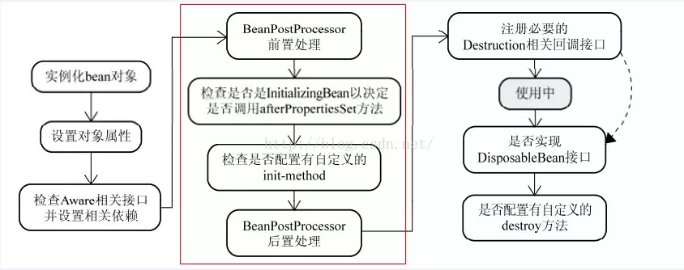

## BeanPostProcessor简介
BeanPostProcessor是Spring IOC容器给我们提供的一个扩展接口。接口声明如下：
```
public interface BeanPostProcessor {
    //bean初始化方法调用前被调用
    Object postProcessBeforeInitialization(Object bean, String beanName) throws BeansException;
    //bean初始化方法调用后被调用
    Object postProcessAfterInitialization(Object bean, String beanName) throws BeansException;
}
```
## 运行顺序

===Spring IOC容器实例化Bean===
===调用BeanPostProcessor的postProcessBeforeInitialization方法===
===调用bean实例的初始化方法===
===调用BeanPostProcessor的postProcessAfterInitialization方法===


## BeanPostProcessor实例
```
/**
 * 后置处理器：初始化前后进行处理工作
 * 将后置处理器加入到容器中
 */
@Component
public class MyBeanPostProcessor implements BeanPostProcessor {

    @Override
    public Object postProcessBeforeInitialization(Object bean, String beanName) throws BeansException {
        // TODO Auto-generated method stub
        System.out.println("postProcessBeforeInitialization..."+beanName+"=>"+bean);
        return bean;
    }

    @Override
    public Object postProcessAfterInitialization(Object bean, String beanName) throws BeansException {
        // TODO Auto-generated method stub
        System.out.println("postProcessAfterInitialization..."+beanName+"=>"+bean);
        return bean;
    }

}
```
## BeanFactoryPostProcessor简介
bean工厂的bean属性处理容器，说通俗一些就是可以管理我们的bean工厂内所有的beandefinition（未实例化）数据，可以随心所欲的修改属性。

## BeanFactoryPostProcessor实例
```
@Component
public class MyBeanFactoryPostProcessor implements BeanFactoryPostProcessor {

    @Override
    public void postProcessBeanFactory(ConfigurableListableBeanFactory beanFactory) throws BeansException {
        System.out.println("MyBeanFactoryPostProcessor...postProcessBeanFactory...");
        int count = beanFactory.getBeanDefinitionCount();
        String[] names = beanFactory.getBeanDefinitionNames();
        System.out.println("当前BeanFactory中有"+count+" 个Bean");
        System.out.println(Arrays.asList(names));
    }

}
```
**区别：**

注册`BeanFactoryPostProcessor`的实例，需要重载
```
void postProcessBeanFactory(ConfigurableListableBeanFactory beanFactory) throws BeansException;
```
通过`beanFactory`可以获取`bean`的示例或定义等。同时可以修改bean的属性，这是和`BeanPostProcessor`最大的区别。


**作者：xbmchina  
链接：https://www.jianshu.com/p/369a54201943  
来源：简书  
著作权归作者所有。商业转载请联系作者获得授权，非商业转载请注明出处。**