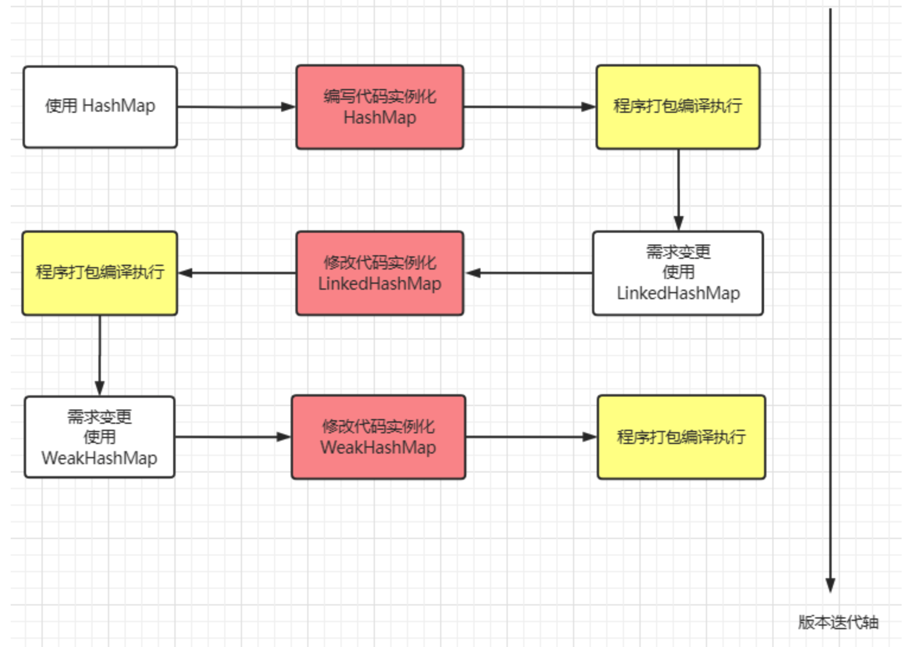
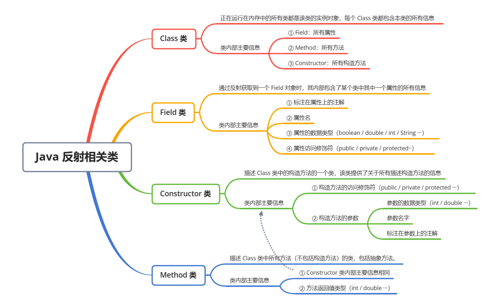

# 反射的思想及作用
有反必有正，就像世间的阴和阳，计算机的0和1一样。  
在学习反射之前，先来了解**正射**是什么。我们平常用的最多的 `new` 方式实例化对象的方式就是一种正射的体现。假如我需要实例化一个`HashMap`，代码就会是这样子。
```
Map<Integer, Integer> map = new HashMap<>();
map.put(1, 1);
```
某一天发现，该段程序不适合用 `HashMap` 存储键值对，更倾向于用`LinkedHashMap`存储。重新编写代码后变成下面这个样子。
```
Map<Integer, Integer> map = new LinkedHashMap<>();
map.put(1, 1);
```
假如又有一天，发现数据还是适合用 `HashMap`来存储，难道又要重新修改源码吗？  
发现问题了吗？我们每次改变一种需求，都要去重新修改源码，然后对代码进行编译，打包，再到 JVM 上重启项目。这么些步骤下来，效率非常低。  
 

对于这种**需求频繁变更但变更不大**的场景，频繁地更改源码肯定是一种不允许的操作，我们可以使用一个`开关`，判断什么时候使用哪一种数据结构。
```
public Map<Integer, Integer> getMap(String param) {
    Map<Integer, Integer> map = null;
    if (param.equals("HashMap")) {
        map = new HashMap<>();
    } else if (param.equals("LinkedHashMap")) {
        map = new LinkedHashMap<>();
    } else if (param.equals("WeakHashMap")) {
        map = new WeakHashMap<>();
    }
    return map;
}
```
通过传入参数`param`决定使用哪一种数据结构，可以在项目运行时，通过动态传入参数决定使用哪一个数据结构。  
如果某一天还想用`TreeMap`，还是避免不了修改源码，重新编译执行的弊端。这个时候，反射就派上用场了。  
在代码运行之前，我们**不确定**将来会使用哪一种数据结构，只有在程序**运行时才决定**使用哪一个数据类，而`反射`可以在**程序运行过程中**动态**获取类信息和调用类方法**。通过反射构造类实例，代码会演变成下面这样。  
```
public Map<Integer, Integer> getMap(String className) {
    Class clazz = Class.forName(className);
    Consructor con = clazz.getConstructor();
    return (Map<Integer, Integer>) con.newInstance();
}
```
无论使用什么 Map，只要实现了`Map接口`，就可以使用`全类名路径`传入到方法中，获得对应的 Map 实例。例如java.util.HashMap / java.util.LinkedHashMap····如果要创建其它类例如`WeakHashMap`，我也不需要修改上面这段源码。  
我们来回顾一下如何从 new 一个对象引出使用反射的。  
+ 在不使用反射时，构造对象使用 new 方式实现，这种方式在编译期就可以把对象的类型确定下来。
+ 如果需求发生变更，需要构造另一个对象，则需要修改源码，非常不优雅，所以我们通过使用开关，在程序运行时判断需要构造哪一个对象，在运行时可以变更开关来实例化不同的数据结构。
+ 如果还有其它扩展的类有可能被使用，就会创建出非常多的分支，且在编码时不知道有什么其他的类被使用到，假如日后Map接口下多了一个集合类是xxxHashMap，还得创建分支，此时引出了反射：可以在运行时才确定使用哪一个数据类，在切换类时，无需重新修改源码、编译程序。
  
第一章总结：  
+ 反射的思想：在程序运行过程中确定和解析数据类的类型。
+ 反射的作用：对于在编译期无法确定使用哪个数据类的场景，通过反射可以在程序运行时构造出不同的数据类实例。

# 反射的基本使用
Java 反射的主要组成部分有4个：
+ `Class`：任何运行在内存中的所有类都是该 Class 类的实例对象，每个 Class 类对象内部都包含了本来的所有信息。记着一句话，通过反射干任何事，先找 Class 准没错！
+ `Field`：描述一个类的属性，内部包含了该属性的所有信息，例如数据类型，属性名，访问修饰符······
+ `Constructor`：描述一个类的构造方法，内部包含了构造方法的所有信息，例如参数类型，参数名字，访问修饰符······
+ `Method`：描述一个类的所有方法（包括抽象方法），内部包含了该方法的所有信息，与Constructor类似，不同之处是 Method 拥有返回值类型信息，因为构造方法是没有返回值的。
  
我总结了一张脑图，放在了下面，如果用到了反射，离不开这核心的4个类，只有去了解它们内部提供了哪些信息，有什么作用，运用它们的时候才能易如反掌。
 

我们在学习反射的基本使用时，我会用一个`SmallPineapple`类作为模板进行说明，首先我们先来熟悉这个类的基本组成：属性，构造函数和方法
```
public class SmallPineapple {
    public String name;
    public int age;
    private double weight; // 体重只有自己知道
    
    public SmallPineapple() {}
    
    public SmallPineapple(String name, int age) {
        this.name = name;
        this.age = age;
    }
    public void getInfo() {
        System.out.print("["+ name + " 的年龄是：" + age + "]");
    }
}
```
反射中的用法有非常非常多，常见的功能有以下这几个：
+ 在运行时获取一个类的 Class 对象
+ 在运行时构造一个类的实例化对象
+ 在运行时获取一个类的所有信息：变量、方法、构造器、注解
  
## 获取类的 Class 对象
在 Java 中，每一个类都会有专属于自己的 Class 对象，当我们编写完.java文件后，使用javac编译后，就会产生一个字节码文件.class，在字节码文件中包含类的所有信息，如属性，构造方法，方法······当字节码文件被装载进虚拟机执行时，会在内存中生成 Class 对象，它包含了该类内部的所有信息，在程序运行时可以获取这些信息。  
获取 Class 对象的方法有3种：
+ 类名.class：这种获取方式只有在编译前已经声明了该类的类型才能获取到 Class 对象
```
Class clazz = SmallPineapple.class;
```
+ 实例.getClass()：通过实例化对象获取该实例的 Class 对象
```
SmallPineapple sp = new SmallPineapple();
Class clazz = sp.getClass();
```
+ Class.forName(className)：通过类的全限定名获取该类的 Class 对象
```
Class clazz = Class.forName("com.bean.smallpineapple");
```
拿到 `Class`对象就可以对它为所欲为了：剥开它的皮（获取类信息）、指挥它做事（调用它的方法），看透它的一切（获取属性），总之它就没有隐私了。  
不过在程序中，每个类的 Class 对象只有一个，也就是说你只有这一个奴隶。我们用上面三种方式测试，通过三种方式打印各个 Class 对象都是相同的。  
```
Class clazz1 = Class.forName("com.bean.SmallPineapple");
Class clazz2 = SmallPineapple.class;
SmallPineapple instance = new SmallPineapple();
Class clazz3 = instance.getClass();
System.out.println("Class.forName() == SmallPineapple.class:" + (clazz1 == clazz2));
System.out.println("Class.forName() == instance.getClass():" + (clazz1 == clazz3));
System.out.println("instance.getClass() == SmallPineapple.class:" + (clazz2 == clazz3));
```
 
内存中只有一个 Class 对象的原因要牵扯到 JVM 类加载机制的双亲委派模型，它保证了程序运行时，加载类时每个类在内存中仅会产生一个Class对象。在这里我不打算详细展开说明，可以简单地理解为 JVM 帮我们保证了一个类在内存中至多存在一个 Class 对象。  
## 构造类的实例化对象
通过反射构造一个类的实例方式有2种：
+ Class 对象调用newInstance()方法
```
Class clazz = Class.forName("com.bean.SmallPineapple");
SmallPineapple smallPineapple = (SmallPineapple) clazz.newInstance();
smallPineapple.getInfo();// [null 的年龄是：0]
```
即使 SmallPineapple 已经显式定义了构造方法，通过 newInstance() 创建的实例中，所有属性值都是对应类型的初始值，因为 newInstance() 构造实例会调用默认无参构造器。
+ Constructor 构造器调用newInstance()方法
```
Class clazz = Class.forName("com.bean.SmallPineapple");
Constructor constructor = clazz.getConstructor(String.class, int.class);
constructor.setAccessible(true);
SmallPineapple smallPineapple2 = (SmallPineapple) constructor.newInstance("小菠萝", 21);
smallPineapple2.getInfo();
// [小菠萝 的年龄是：21]
```
通过 getConstructor(Object... paramTypes) 方法指定获取指定参数类型的 Constructor， Constructor 调用 newInstance(Object... paramValues) 时传入构造方法参数的值，同样可以构造一个实例，且内部属性已经被赋值。  
通过Class对象调用 newInstance() 会走默认无参构造方法，如果想通过显式构造方法构造实例，需要提前从Class中调用getConstructor()方法获取对应的构造器，通过构造器去实例化对象。  

这些 API 是在开发当中最常遇到的，当然还有非常多重载的方法，本文由于篇幅原因，且如果每个方法都一一讲解，我们也记不住，所以用到的时候去类里面查找就已经足够了。 

## 获取一个类的所有信息
Class 对象中包含了该类的所有信息，在编译期我们能看到的信息就是该类的变量、方法、构造器，在运行时最常被获取的也是这些信息。  
 

## 获取类中的变量（Field）
+ Field[] getFields()：获取类中所有被public修饰的所有变量
+ Field getField(String name)：根据变量名获取类中的一个变量，该变量必须被public修饰
+ Field[] getDeclaredFields()：获取类中所有的变量，但无法获取继承下来的变量
+ Field getDeclaredField(String name)：根据姓名获取类中的某个变量，无法获取继承下来的变量
  
## 获取类中的方法（Method）
+ Method[] getMethods()：获取类中被public修饰的所有方法
+ Method getMethod(String name, Class...<?> paramTypes)：根据名字和参数类型获取对应方法，该方法必须被public修饰
+ Method[] getDeclaredMethods()：获取所有方法，但无法获取继承下来的方法
+ Method getDeclaredMethod(String name, Class...<?> paramTypes)：根据名字和参数类型获取对应方法，无法获取继承下来的方法
  
## 获取类的构造器（Constructor）
+ Constuctor[] getConstructors()：获取类中所有被public修饰的构造器
+ Constructor getConstructor(Class...<?> paramTypes)：根据参数类型获取类中某个构造器，该构造器必须被public修饰
+ Constructor[] getDeclaredConstructors()：获取类中所有构造器
+ Constructor getDeclaredConstructor(class...<?> paramTypes)：根据参数类型获取对应的构造器    
  
每种功能内部以 Declared 细分为2类：
```
有Declared修饰的方法：可以获取该类内部包含的所有变量、方法和构造器，但是无法获取继承下来的信息
无Declared修饰的方法：可以获取该类中public修饰的变量、方法和构造器，可获取继承下来的信息
```
如果想获取类中所有的（包括继承）变量、方法和构造器，则需要同时调用getXXXs()和getDeclaredXXXs()两个方法，用Set集合存储它们获得的变量、构造器和方法，以防两个方法获取到相同的东西。  
例如：要获取SmallPineapple获取类中所有的变量，代码应该是下面这样写。
```
Class clazz = Class.forName("com.bean.SmallPineapple");// 获取 public 属性，包括继承
Field[] fields1 = clazz.getFields();// 获取所有属性，不包括继承
Field[] fields2 = clazz.getDeclaredFields();// 将所有属性汇总到 set
Set<Field> allFields = new HashSet<>();
allFields.addAll(Arrays.asList(fields1));
allFields.addAll(Arrays.asList(fields2));
```
不知道你有没有发现一件有趣的事情，如果父类的属性用protected修饰，利用反射是无法获取到的。  
protected 修饰符的作用范围：只允许同一个包下或者子类访问，可以继承到子类。
getFields() 只能获取到本类的public属性的变量值；  
getDeclaredFields() 只能获取到本类的所有属性，不包括继承的；无论如何都获取不到父类的 protected 属性修饰的变量，但是它的的确确存在于子类中。  
## 获取注解
获取注解单独拧了出来，因为它并不是专属于 Class 对象的一种信息，每个变量，方法和构造器都可以被注解修饰，所以在反射中，Field，Constructor 和 Method 类对象都可以调用下面这些方法获取标注在它们之上的注解。
+ Annotation[] getAnnotations()：获取该对象上的所有注解
+ Annotation getAnnotation(Class annotaionClass)：传入注解类型，获取该对象上的特定一个注解
+ Annotation[] getDeclaredAnnotations()：获取该对象上的显式标注的所有注解，无法获取继承下来的注解
+ Annotation getDeclaredAnnotation(Class annotationClass)：根据注解类型，获取该对象上的特定一个注解，无法获取继承下来的注解
  
只有注解的@Retension标注为RUNTIME时，才能够通过反射获取到该注解，@Retension 有3种保存策略：
+ SOURCE：只在源文件(.java)中保存，即该注解只会保留在源文件中，编译时编译器会忽略该注解，例如 @Override 注解
+ CLASS：保存在字节码文件(.class)中，注解会随着编译跟随字节码文件中，但是运行时不会对该注解进行解析
+ RUNTIME：一直保存到运行时，用得最多的一种保存策略，在运行时可以获取到该注解的所有信息
  
像下面这个例子，SmallPineapple 类继承了抽象类`Pineapple`，`getInfo()`方法上标识有 `@Override` 注解，且在子类中标注了`@Transient`注解，在运行时获取子类重写方法上的所有注解，只能获取到`@Transient`的信息。
```
public abstract class Pineapple {
    public abstract void getInfo();
}public class SmallPineapple extends Pineapple {
    @Transient
    @Override
    public void getInfo() {
        System.out.print("小菠萝的身高和年龄是:" + height + "cm ; " + age + "岁");
    }
}
```
启动类Bootstrap获取 SmallPineapple 类中的 getInfo() 方法上的注解信息：
```
public class Bootstrap {
    /**
     * 根据运行时传入的全类名路径判断具体的类对象
     * @param path 类的全类名路径
     */
    public static void execute(String path) throws Exception {
        Class obj = Class.forName(path);
        Method method = obj.getMethod("getInfo");
        Annotation[] annotations = method.getAnnotations();
        for (Annotation annotation : annotations) {
            System.out.println(annotation.toString());
        }
    }
    public static void main(String[] args) throws Exception {
        execute("com.pineapple.SmallPineapple");
    }
}
// @java.beans.Transient(value=true)
```
## 通过反射调用方法
通过反射获取到某个 Method 类对象后，可以通过调用invoke方法执行。
+ invoke(Oject obj, Object... args)：参数`1指定调用该方法的对象，参数2是方法的参数列表值。
  
如果调用的方法是静态方法，参数1只需要传入null，因为静态方法不与某个对象有关，只与某个类有关。  
可以像下面这种做法，通过反射实例化一个对象，然后获取Method方法对象，调用invoke()指定SmallPineapple的getInfo()方法。  
```
Class clazz = Class.forName("com.bean.SmallPineapple");
Constructor constructor = clazz.getConstructor(String.class, int.class);
constructor.setAccessible(true);
SmallPineapple sp = (SmallPineapple) constructor.newInstance("小菠萝", 21);
Method method = clazz.getMethod("getInfo");if (method != null) {
    method.invoke(sp, null);
}
// [小菠萝的年龄是：21]
```
# 反射的应用场景
反射常见的应用场景这里介绍3个：
+ Spring 实例化对象：当程序启动时，Spring 会读取配置文件applicationContext.xml并解析出里面所有的 标签实例化到IOC容器中。
+ 反射 + 工厂模式：通过反射消除工厂中的多个分支，如果需要生产新的类，无需关注工厂类，工厂类可以应对各种新增的类，反射可以使得程序更加健壮。
+ JDBC连接数据库：使用JDBC连接数据库时，指定连接数据库的驱动类时用到反射加载驱动类
  
## Spring 的 IOC 容器
在 Spring 中，经常会编写一个上下文配置文件`applicationContext.xml`，里面就是关于bean的配置，程序启动时会读取该 xml 文件，解析出所有的`<bean>`标签，并实例化对象放入IOC容器中。
```
<?xml version="1.0" encoding="UTF-8"?>
<beans xmlns="http://www.springframework.org/schema/beans"
       xmlns:xsi="http://www.w3.org/2001/XMLSchema-instance"
       xsi:schemaLocation="http://www.springframework.org/schema/beans http://www.springframework.org/schema/beans/spring-beans.xsd">
    <bean id="smallpineapple" class="com.bean.SmallPineapple">
        <constructor-arg type="java.lang.String" value="小菠萝"/>
        <constructor-arg type="int" value="21"/>
    </bean>
</beans>
```
在定义好上面的文件后，通过`ClassPathXmlApplicationContext`加载该配置文件，程序启动时，Spring 会将该配置文件中的所有bean都实例化，放入 IOC 容器中，IOC 容器本质上就是一个工厂，通过该工厂传入标签的id属性获取到对应的实例。
```
public class Main {
    public static void main(String[] args) {
        ApplicationContext ac =
                new ClassPathXmlApplicationContext("applicationContext.xml");
        SmallPineapple smallPineapple = (SmallPineapple) ac.getBean("smallpineapple");
        smallPineapple.getInfo(); // [小菠萝的年龄是：21]
    }
}
```
Spring 在实例化对象的过程经过简化之后，可以理解为反射实例化对象的步骤：
+ 获取Class对象的构造器
+ 通过构造器调用 newInstance() 实例化对象
  
当然 Spring 在实例化对象时，做了非常多额外的操作，才能够让现在的开发足够的便捷且稳定。
在之后的文章中会专门写一篇文章讲解如何利用反射实现一个简易版的IOC容器，IOC容器原理很简单，只要掌握了反射的思想，了解反射的常用 API 就可以实现，我可以提供一个简单的思路：利用 HashMap 存储所有实例，key 代表 \ 标签的 id，value 存储对应的实例，这对应了 Spring IOC容器管理的对象默认是单例的。
## 反射 + 抽象工厂模式
传统的工厂模式，如果需要生产新的子类，需要修改工厂类，在工厂类中增加新的分支；
```
public class MapFactory {
    public Map<Object, object> produceMap(String name) {
        if ("HashMap".equals(name)) {
            return new HashMap<>();
        } else if ("TreeMap".equals(name)) {
            return new TreeMap<>();
        } // ···
    }
}
```
利用反射和工厂模式相结合，在产生新的子类时，工厂类不用修改任何东西，可以专注于子类的实现，当子类确定下来时，工厂也就可以生产该子类了。  
反射 + 抽象工厂的核心思想是：
+ 在运行时通过参数传入不同子类的全限定名获取到不同的 Class 对象，调用 newInstance() 方法返回不同的子类。细心的读者会发现提到了子类这个概念，所以反射 + 抽象工厂模式，一般会用于有继承或者接口实现关系。
  
例如，在运行时才确定使用哪一种 Map 结构，我们可以利用反射传入某个具体 Map 的全限定名，实例化一个特定的子类。
```
public class MapFactory {
    /**
     * @param className 类的全限定名
     */
    public Map<Object, Object> produceMap(String className) {
        Class clazz = Class.forName(className);
        Map<Object, Object> map = clazz.newInstance();
        return map;
    }
}
```
`className` 可以指定为 java.util.HashMap，或者 java.util.TreeMap 等等，根据业务场景来定。
## JDBC 加载数据库驱动类
在导入第三方库时，JVM不会主动去加载外部导入的类，而是等到真正使用时，才去加载需要的类，正是如此，我们可以在获取数据库连接时传入驱动类的全限定名，交给 JVM 加载该类。
```
public class DBConnectionUtil {
    /** 指定数据库的驱动类 */
    private static final String DRIVER_CLASS_NAME = "com.mysql.jdbc.Driver";
    
    public static Connection getConnection() {
        Connection conn = null;
        // 加载驱动类
        Class.forName(DRIVER_CLASS_NAME);
        // 获取数据库连接对象
        conn = DriverManager.getConnection("jdbc:mysql://···", "root", "root");
        return conn;
    }
}
```
在我们开发 SpringBoot 项目时，会经常遇到这个类，但是可能习惯成自然了，就没多大在乎，我在这里给你们看看常见的`application.yml`中的数据库配置，我想你应该会恍然大悟吧。
 
这里的 driver-class-name，和我们一开始加载的类是不是觉得很相似，这是因为MySQL版本不同引起的驱动类不同，这体现使用反射的好处：不需要修改源码，仅加载配置文件就可以完成驱动类的替换。  
在之后的文章中会专门写一篇文章详细地介绍反射的应用场景，实现简单的IOC容器以及通过反射实现工厂模式的好处。  
在这里，你只需要掌握反射的基本用法和它的思想，了解它的主要使用场景。  
# 反射的优势及缺陷
反射的优点：
+ 增加程序的灵活性：面对需求变更时，可以灵活地实例化不同对象  
  
但是，有得必有失，一项技术不可能只有优点没有缺点，反射也有两个比较隐晦的缺点：
+ 破坏类的封装性：可以强制访问 private 修饰的信息
+ 性能损耗：反射相比直接实例化对象、调用方法、访问变量，中间需要非常多的检查步骤和解析步骤，JVM无法对它们优化。
## 增加程序的灵活性
这里不再用 SmallPineapple 举例了，我们来看一个更加贴近开发的例子：
+ 利用反射连接数据库，涉及到数据库的数据源。在 SpringBoot 中一切约定大于配置，想要定制配置时，使用application.properties配置文件指定数据源
  
**角色1 - Java的设计者**：我们设计好DataSource接口，你们其它数据库厂商想要开发者用你们的数据源监控数据库，就得实现我的这个接口！  
**角色2 - 数据库厂商**：
+ MySQL 数据库厂商：我们提供了 com.mysql.cj.jdbc.MysqlDataSource 数据源，开发者可以使用它连接 MySQL。
+ 阿里巴巴厂商：我们提供了 com.alibaba.druid.pool.DruidDataSource 数据源，我这个数据源更牛逼，具有页面监控，慢SQL日志记录等功能，开发者快来用它监控 MySQL吧！
+ SQLServer 厂商：我们提供了 com.microsoft.sqlserver.jdbc.SQLServerDataSource 数据源，如果你想实用SQL Server 作为数据库，那就使用我们的这个数据源连接吧
  
**角色3 - 开发者**：我们可以用配置文件指定使用`DruidDataSource`数据源
```
spring.datasource.type=com.alibaba.druid.pool.DruidDataSource
```
需求变更：某一天，老板来跟我们说，Druid 数据源不太符合我们现在的项目了，我们使用 MysqlDataSource 吧，然后程序猿就会修改配置文件，重新加载配置文件，并重启项目，完成数据源的切换。
```
spring.datasource.type=com.mysql.cj.jdbc.MysqlDataSource
```
在改变连接数据库的数据源时，只需要改变配置文件即可，无需改变任何代码，原因是：
+ Spring Boot 底层封装好了连接数据库的数据源配置，利用反射，适配各个数据源。
  
下面来简略的进行源码分析。我们用ctrl+左键点击spring.datasource.type进入 DataSourceProperties 类中，发现使用setType() 将全类名转化为 Class 对象注入到type成员变量当中。在连接并监控数据库时，就会使用指定的数据源操作。
```
private Class<? extends DataSource> type;
public void setType(Class<? extends DataSource> type) {
    this.type = type;
}
```
Class对象指定了泛型上界DataSource，我们去看一下各大数据源的类图结构。

 
上图展示了一部分数据源，当然不止这些，但是我们可以看到，无论指定使用哪一种数据源，我们都只需要与配置文件打交道，而无需更改源码，这就是反射的灵活性！  
## 破坏类的封装性
很明显的一个特点，反射可以获取类中被private修饰的变量、方法和构造器，这违反了面向对象的封装特性，因为被 private 修饰意味着不想对外暴露，只允许本类访问，而setAccessable(true)可以无视访问修饰符的限制，外界可以强制访问。  
还记得单例模式一文吗？里面讲到反射破坏饿汉式和懒汉式单例模式，所以之后用了枚举避免被反射KO。  
回到最初的起点，SmallPineapple 里有一个 weight 属性被 private 修饰符修饰，目的在于自己的体重并不想给外界知道。
```
public class SmallPineapple {
    public String name;
    public int age;
    private double weight; // 体重只有自己知道
    
    public SmallPineapple(String name, int age, double weight) {
        this.name = name;
        this.age = age;
        this.weight = weight;
    } 
}
```
虽然 weight 属性理论上只有自己知道，但是如果经过反射，这个类就像在裸奔一样，在反射面前变得一览无遗。
```
SmallPineapple sp = new SmallPineapple("小菠萝", 21, "54.5");
Clazz clazz = Class.forName(sp.getClass());
Field weight = clazz.getDeclaredField("weight");
weight.setAccessable(true);
System.out.println("窥觑到小菠萝的体重是：" + weight.get(sp));
// 窥觑到小菠萝的体重是：54.5 kg
```
## 性能损耗
在直接 new 对象并调用对象方法和访问属性时，编译器会在编译期提前检查可访问性，如果尝试进行不正确的访问，IDE会提前提示错误，例如参数传递类型不匹配，非法访问 private 属性和方法。  
而在利用反射操作对象时，编译器无法提前得知对象的类型，访问是否合法，参数传递类型是否匹配。只有在程序运行时调用反射的代码时才会从头开始检查、调用、返回结果，JVM也无法对反射的代码进行优化。  
虽然反射具有性能损耗的特点，但是我们不能一概而论，产生了使用反射就会性能下降的思想，反射的慢，需要同时调用上100W次才可能体现出来，在几次、几十次的调用，并不能体现反射的性能低下。所以不要一味地戴有色眼镜看反射，在单次调用反射的过程中，性能损耗可以忽略不计。如果程序的性能要求很高，那么尽量不要使用反射。  
# 反射基础篇文末总结
+ 反射的思想：反射就像是一面镜子一样，在运行时才看到自己是谁，可获取到自己的信息，甚至实例化对象。
+ 反射的作用：在运行时才确定实例化对象，使程序更加健壮，面对需求变更时，可以最大程度地做到不修改程序源码应对不同的场景，实例化不同类型的对象。
+ 反射的应用场景常见的有3个：Spring的 IOC 容器，反射+工厂模式 使工厂类更稳定，JDBC连接数据库时加载驱动类
+ 反射的3个特点：增加程序的灵活性、破坏类的封装性以及性能损耗
  
作者：程序员cxuan  
链接：https://juejin.im/post/6864324335654404104  
来源：掘金  
著作权归作者所有。商业转载请联系作者获得授权，非商业转载请注明出处。