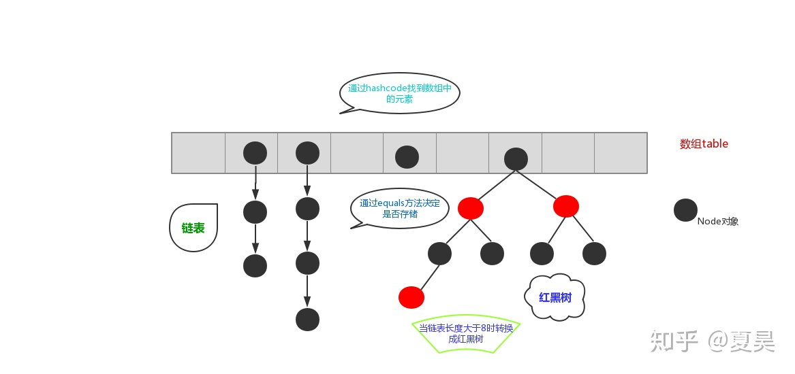
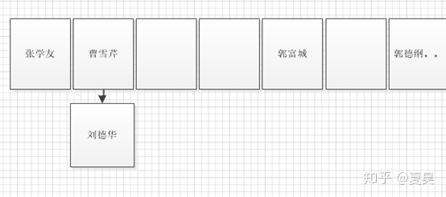
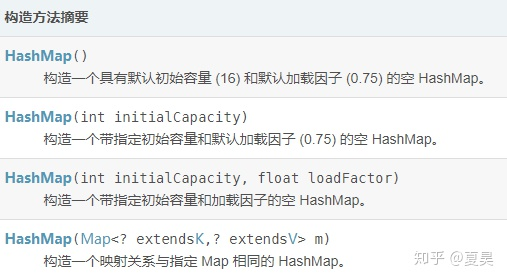

# 方法一：暴力枚举  
## 思路及算法

最容易想到的方法是枚举数组中的每一个数 x，寻找数组中是否存在 target - x。

当我们使用遍历整个数组的方式寻找 target - x 时，需要注意到每一个位于 x 之前的元素都已经和 x 匹配过，因此不需要再进行匹配。而每一个元素不能被使用两次，所以我们只需要在 x 后面的元素中寻找 target - x。

代码
```
class Solution {
    public int[] twoSum(int[] nums, int target) {
        int n = nums.length;
        for (int i = 0; i < n; ++i) {
            for (int j = i + 1; j < n; ++j) {
                if (nums[i] + nums[j] == target) {
                    return new int[]{i, j};
                }
            }
        }
        return new int[0];
    }
}
```
## 复杂度分析

时间复杂度：O(N^2)，其中 N 是数组中的元素数量。最坏情况下数组中任意两个数都要被匹配一次。

空间复杂度：O(1)。

# 方法二：哈希表  
## 思路及算法

注意到方法一的时间复杂度较高的原因是寻找 target - x 的时间复杂度过高。因此，我们需要一种更优秀的方法，能够快速寻找数组中是否存在目标元素。如果存在，我们需要找出它的索引。

使用哈希表，可以将寻找 target - x 的时间复杂度降低到从 O(N) 降低到 O(1)。

这样我们创建一个哈希表，对于每一个 x，我们首先查询哈希表中是否存在 target - x，然后将 x 插入到哈希表中，即可保证不会让 x 和自己匹配。

代码
```
class Solution {
    public int[] twoSum(int[] nums, int target) {
        Map<Integer, Integer> hashtable = new HashMap<Integer, Integer>();
        for (int i = 0; i < nums.length; ++i) {
            if (hashtable.containsKey(target - nums[i])) {
                return new int[]{hashtable.get(target - nums[i]), i};
            }
            hashtable.put(nums[i], i);
        }
        return new int[0];
    }
}
```
## 复杂度分析

时间复杂度：O(N)，其中 N 是数组中的元素数量。对于每一个元素 x，我们可以 O(1) 地寻找 target - x。

空间复杂度：O(N)，其中 N 是数组中的元素数量。主要为哈希表的开销。

作者：LeetCode-Solution  
链接：https://leetcode-cn.com/problems/two-sum/solution/liang-shu-zhi-he-by-leetcode-solution/  
来源：力扣（LeetCode）  
著作权归作者所有。商业转载请联系作者获得授权，非商业转载请注明出处。


# HashMap分析

一：HashMap的节点：HashMap是一个集合，键值对的集合,源码中每个节点用Node<K,V>表示
```
static class Node<K,V> implements Map.Entry<K,V> {
   final int hash;
   final K key;
   V value;
   Node<K,V> next;
}
```
Node是一个内部类，这里的key为键，value为值，next指向下一个元素，可以看出HashMap中的元素不是一个单纯的键值对，还包含下一个元素的引用。

二：HashMap的数据结构：HashMap的数据结构为 数组+(链表或红黑树)，上图：

为什么采用这种结构来存储元素呢？

数组的特点：查询效率高，插入，删除效率低。

链表的特点：查询效率低，插入删除效率高。

在HashMap底层使用数组加（链表或红黑树）的结构完美的解决了数组和链表的问题，使得查询和插入，删除的效率都很高。

三：HashMap存储元素的过程：

有这样一段代码：
```
HashMap<String,String> map = new HashMap<String,String>();
map.put("刘德华","张惠妹");
map.put("张学友","大S");
```
现在我要把键值对 “刘德华”,”张惠妹”存入map:

第一步：计算出键“刘德华”的hashcode，该值用来定位要将这个元素存放到数组中的什么位置.

什么是hashcode？

在Object类中有一个方法:
```
public native int hashCode();
```
该方法用native修饰，所以是一个本地方法，所谓本地方法就是非java代码，这个代码通常用c或c++写成，在java中可以去调用它。

调用这个方法会生成一个int型的整数，我们叫它哈希码，哈希码和调用它的对象地址和内容有关.

哈希码的特点是:

对于同一个对象如果没有被修改（使用equals比较返回true）那么无论何时它的hashcode值都是相同的

对于两个对象如果他们的equals返回false,那么他们的hashcode值也有可能相等

明白了hashcode我们再来看元素如何通过hashcode定位到要存储在数组的哪里，通过hashcode值和数组长度取模我们可以得到元素存储的下标。

刘德华的hashcode为20977295 数组长度为 16则要存储在数组索引为 20977295%16=1的地方


可以分两种情况:

1. 数组索引为1的地方是空的，这种情况很简单，直接将元素放进去就好了。

2. 已经有元素占据了索引为1的位置，这种情况下我们需要判断一下该位置的元素和当前元素是否相等，使用equals来比较。

如果使用默认的规则是比较两个对象的地址。也就是两者需要是同一个对象才相等，当然我们也可以重写equals方法来实现我们自己的比较规则最常见的是通过比较属性值来判断是否相等。

如果两者相等则直接覆盖，如果不等则在原元素下面使用链表的结构存储该元素


每个元素节点都有一个next属性指向下一个节点，这里由数组结构变成了数组+链表结构,红黑树又是怎么回事呢？

因为链表中元素太多的时候会影响查找效率，所以当链表的元素个数达到8的时候使用链表存储就转变成了使用红黑树存储，原因就是红黑树是平衡二叉树，在查找性能方面比链表要高.

四：HashMap中的两个重要的参数：HashMap中有两个重要的参数：初始容量大小和加载因子，初始容量大小是创建时给数组分配的容量大小，默认值为16，用数组容量大小乘以加载因子得到一个值，一旦数组中存储的元素个数超过该值就会调用rehash方法将数组容量增加到原来的两倍，专业术语叫做扩容.

在做扩容的时候会生成一个新的数组，原来的所有数据需要重新计算哈希码值重新分配到新的数组，所以扩容的操作非常消耗性能.


创建HashMap时我们可以通过合理的设置初始容量大小来达到尽量少的扩容的目的。加载因子也可以设置，但是除非特殊情况不建议设置.

# hashmap什么时候会触发扩容？
1. 当HashMap中元素总个数达到阈值时就会扩容。注意是元素总个数，而不是数组占用个数。
```
// 数组扩容阈值,即：HashMap数组总容量 * 负载因子
int threshold
// 如果元素个数大于阈值，扩充数组。 
if (++size > threshold)  
    resize();
```

2. 比较复杂，当向HashMap中添加元素时，即调用 
```
final V putVal(int hash, K key, V value, boolean onlyIfAbsent, boolean evict)
```
方法时，如果通过hash值计算数组的索引，获取该索引位的首节点，且该首节点不为null时（即发生了Hash碰撞），会有对应三种处理情况：
1. 新添加元素的key与首节点元素的key相同，即
```
// 如果首节点的key和要存入的key相同，那么直接覆盖value的值。
// p：hash值对应索引位置的首节点 
if (p.hash == hash && ((k = p.key) == key || (key != null && key.equals(k)))) 
    e = p;
```

2. 如果首节点是红黑树节点（TreeNode），将键值对添加到红黑树。
```// 如果首节点是红黑树的，将键值对插添加到红黑树 
else if (p instanceof HashMap.TreeNode) 
    e = ((HashMap.TreeNode<K,V>)p).putTreeVal(this, tab, hash, key, value);
```
3. 如果首节点是链表，将键值对添加到链表。添加之后会判断链表长度是否到达TREEIFY_THRESHOLD - 1这个阈值，“尝试”将链表转换成红黑树。
```// p.next == null，到达链表末尾，添加新节点，如果长度足够，转换成树结构。 
if ((e = p.next) == null) { 
    p.next = newNode(hash, key, value, null);  
    if (binCount >= TREEIFY_THRESHOLD - 1) // -1 for 1st  
        treeifyBin(tab, hash);  
    break; 
}
```
而关键在于这个treeifyBin()方法中，如果 
```
// 把链表转换为红黑色 
final void treeifyBin(Node<K,V>[] tab, int hash) { 
    int n, index; Node<K,V> e;  // 如果当前数组容量太小（小于64），放弃转换，扩充数组。  
    if (tab == null || (n = tab.length) < MIN_TREEIFY_CAPACITY) {  
        resize();  
    } else if ((e = tab[index = (n - 1) & hash]) != null) {  
        // 将链表转成红黑树... 
    } 
}
```
HashMap在jdk1.8之后引入了红黑树的概念，表示若桶中链表元素超过8时，会自动转化成红黑树；若桶中元素小于等于6时，树结构还原成链表形式。而如果当前数组的容量太小（小于64），则放弃转换，扩充数组。扩充数组！扩充数组！扩充数组！

这样就有可能有一种情况出现，就是说我整个HashMap并没有达到负载因子那么多的元素个数，但是，我进行了一次扩容。所以单纯的以负载因子来看是否会发生扩容，是不全面的。 

那我们来分析为什么要进行这一次扩容。 
首先我们要理解HashMap为什么要进行扩容，扩容这个操作真正的意义在哪里？为什么要定义一个负载因子？设计他的初衷究竟是为了解决什么问题？ 

为什么要扩容呢，之所以要扩容，我理解是基于两个逻辑， 
1. HashMap中元素个数实在太多了，已经很频繁的发生hash冲突，我不得不进行扩容来减少这个冲突，来增强效率。 
2. HashMap中元素并不多，但元素都集中到那么一两个“坑位”上，数组占用的位置很少，但是在那一两个位置上的元素已经很多了，拖掉了执行的效率。即核心是一个分布不均匀的问题，在这样的情况下，扩容的目的，就是通过重新计算hash“坑位”让原来聚集在一起的节点分散开来，是为了让分布更加均匀。 

而treeifyBin()方法中，之所以判断当前数组容量是否太小，也是基于第二个逻辑上的考量，因为数组容量很小，但是已经存在过长的链表需要转换成树结构，不如直接进行一次扩容，毕竟树的查询效率O(logn)也比不上一个正常HashMap的O(1)的效率。

作者：Anti-General  
链接：https://www.nowcoder.com/discuss/365868?type=0&order=0&pos=29&page=0  
来源：牛客网